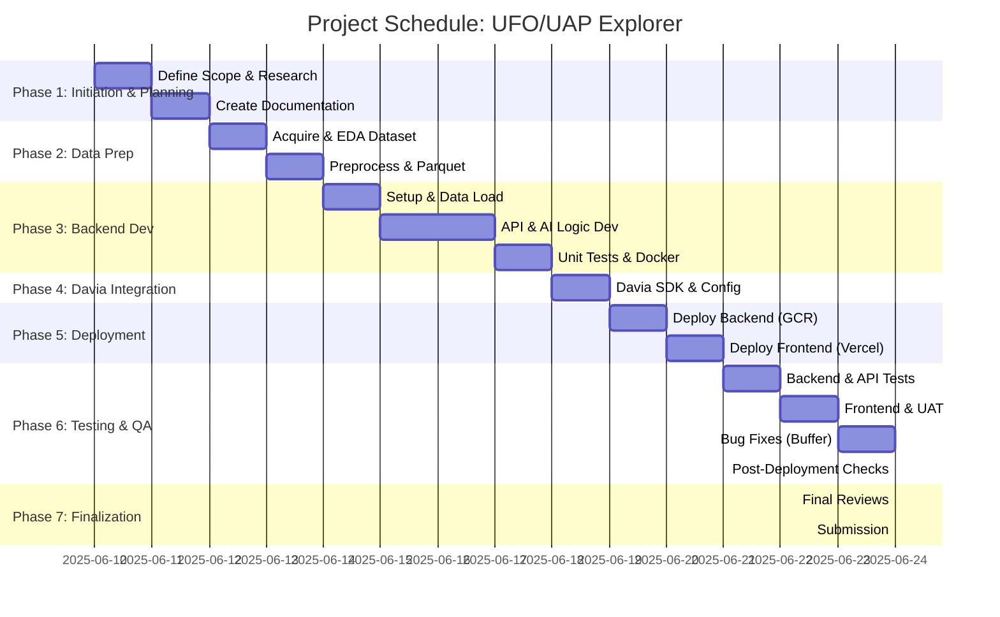

# Project Schedule (High-Level)
## Project Title: Interactive UFO/UAP Sightings Explorer & AI Analyst

This document outlines a high-level, estimated schedule for the Interactive UFO/UAP Sightings Explorer project. Given this is a project for a job application, the timeline is condensed and assumes focused effort. The "Duration" is in conceptual "work sessions" or "days" of focused effort, not necessarily strict calendar days.

---

**Phase 1: Project Initiation & Planning (Duration: 1-2 Work Sessions)**
*   **Task 1.1:** Define Project Scope & Objectives
    *   *Est. Duration:* 0.5 Work Session
*   **Task 1.2:** Initial Research (Davia SDK, Vercel, GCR)
    *   *Est. Duration:* 0.5 Work Session
*   **Task 1.3 & 1.4:** Create Core & Ancillary Documentation
    *   *Est. Duration:* 1 Work Session (Leveraging templates and prior analysis)

**Phase 2: Data Acquisition & Preprocessing (Duration: 1 Work Session)**
*   **Task 2.1:** Identify and Download NUFORC Dataset
    *   *Est. Duration:* 0.25 Work Session
*   **Task 2.2:** Perform EDA
    *   *Est. Duration:* 0.25 Work Session
*   **Task 2.3 & 2.4:** Develop Preprocessing Script & Generate Parquet File
    *   *Est. Duration:* 0.5 Work Session
*   **Task 2.5:** Document Preprocessing
    *   *Est. Duration:* (Covered in 1.3.6)

**Phase 3: Backend API Development (Duration: 2-3 Work Sessions)**
*   **Task 3.1 - 3.2:** Setup Backend Project & Data Loading
    *   *Est. Duration:* 0.5 Work Session
*   **Task 3.3 - 3.7:** Develop API Endpoints, Logic, AI Assistant, OpenAPI Spec
    *   *Est. Duration:* 1.5 - 2 Work Sessions
*   **Task 3.8:** Develop Backend Unit Tests
    *   *Est. Duration:* 0.5 Work Session
*   **Task 3.9 - 3.10:** Create `Dockerfile` & `requirements.txt`
    *   *Est. Duration:* 0.25 Work Session (Can be done alongside development)

**Phase 4: Davia SDK Integration & Frontend Configuration (Duration: 0.5 - 1 Work Session)**
*   **Task 4.1 - 4.3:** Familiarize with Davia, Ensure OpenAPI compatibility, Configure Davia Platform
    *   *Est. Duration:* 0.5 - 1 Work Session (Highly dependent on Davia platform ease of use)

**Phase 5: Deployment (Duration: 1 Work Session)**
*   **Task 5.1:** Backend Deployment to Google Cloud Run
    *   *Est. Duration:* 0.5 Work Session (Includes initial troubleshooting)
*   **Task 5.2:** Frontend Deployment to Vercel
    *   *Est. Duration:* 0.5 Work Session (Includes initial troubleshooting)

**Phase 6: Testing & Quality Assurance (Duration: 1-2 Work Sessions)**
*   **Task 6.1 - 6.2:** Execute Backend Unit Tests & API Integration Tests
    *   *Est. Duration:* 0.5 Work Session
*   **Task 6.3 - 6.4:** Perform Frontend Functional Testing & UAT
    *   *Est. Duration:* 0.5 - 1 Work Session
*   **Task 6.5:** Document Bugs, Iterate & Fix
    *   *Est. Duration:* Ongoing, buffer of 0.5 Work Session
*   **Task 6.6:** Perform Post-Deployment Checks
    *   *Est. Duration:* 0.25 Work Session

**Phase 7: Project Finalization & Submission (Duration: 0.5 Work Session)**
*   **Task 7.1 - 7.2:** Final Review of Documentation & Code
    *   *Est. Duration:* 0.25 Work Session
*   **Task 7.3 - 7.4:** Prepare & Send Submission Email
    *   *Est. Duration:* 0.25 Work Session

---

**Total Estimated Duration: Approximately 7 - 10.5 Work Sessions**

**Timeline Visualization (Conceptual Gantt Chart - simplified):**

**Notes:**
*   This schedule is aggressive and assumes the developer can dedicate focused blocks of time.
*   Dependencies between tasks are critical (e.g., backend API must be somewhat stable before Davia integration).
*   Flexibility is key; some tasks might take longer or shorter than estimated.
*   "Work Sessions" can be interpreted as 2-4 hour blocks of focused work, or full days depending on availability. The goal is to complete this project in a timeframe suitable for a job application (e.g., 1-2 weeks of part-time to full-time effort).
